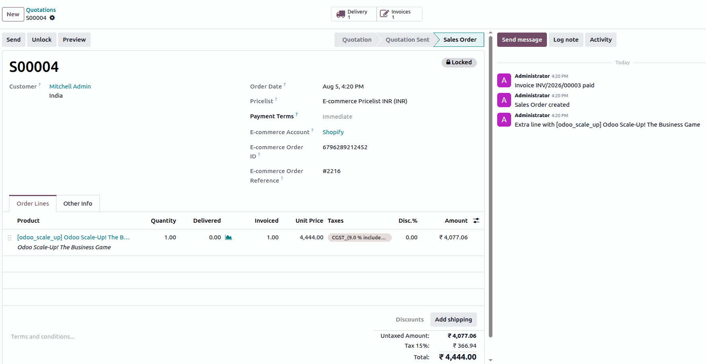

============================================
Shopify fulfillment, accounting, and returns
============================================

The Shopify Connector synchronizes fulfillments and shipping information, creates invoices and
registers payments, and processes returns and refunds between Shopify and Odoo.

.. _shopify/fulfillment:

Fulfillment and shipping
========================

A shipping line is added to the order with the default product :guilabel:`Ecommerce-shipping`. The
amount and the actual name of the delivery carrier selected by the customer (such as Sendcloud,
Shiprocket, or FedEx) is added in the description of that line.

Fulfillment modes
-----------------

You can configure who handles the delivery: Odoo or Shopify.

Deliveries handled in Odoo
~~~~~~~~~~~~~~~~~~~~~~~~~~

When deliveries are handled in Odoo:

- The delivery is created in the :guilabel:`Assigned` state in Odoo.
- After the delivery order is validated in Odoo, a scheduled action running every 10 minutes pushes
  the shipment to Shopify.
- The order is marked as fulfilled on Shopify, along with the carrier and tracking number from Odoo.
- Shopify notifies the customer after the fulfillment is created.

.. note::
   If deliveries are handled in Odoo, returns initiated in Shopify do **not** sync automatically, and
   must be handled manually in Odoo.

Deliveries handled in Shopify
~~~~~~~~~~~~~~~~~~~~~~~~~~~~~

When deliveries are handled in Shopify:

- The fulfillment is created in Shopify.
- During synchronization, a default delivery is created along with the sales order for proper
  inventory synchronization.
- Fulfillment details (carrier, tracking number, and quantities) are pulled into Odoo when an actual
  fulfillment is created on Shopify.
- Corresponding pickings are created as a backorder of the default picking, to reduce inventory if
  there is a difference between the actual fulfillment and the delivered quantity.

.. note::
   If a fulfillment exists in Shopify but is not created in Odoo for any reason (including a
   discrepancy at the order or invoice level), an activity is scheduled for resolution.

For deliveries handled in Shopify, split fulfillments are fully supported and synchronized correctly.
Multiple fulfillments can be created for the same order, including:

- Fulfillment from different locations.
- Multiple fulfillments from the same location.
- Different carriers for different shipments.
- Partial quantity fulfillments across shipments.

All fulfillment details, including location, carrier, tracking numbers, and fulfilled quantities, are
synced accurately into Odoo, with corresponding stock moves and delivery updates.

Fulfillment location handling
-----------------------------

- Fulfillment locations from Shopify are mapped to the corresponding Odoo warehouse locations.
- During fulfillment synchronization, the delivery picking is automatically assigned to the mapped
  Odoo location.
- This ensures stock movements are recorded against the correct warehouse or location, and maintains
  inventory accuracy across multiple fulfillment centers.

Inventory synchronization
-------------------------

- Fulfillments received from Shopify are processed using a backorder-based approach.
- Partial fulfillments automatically generate the required backorders in Odoo, ensuring that
  fulfilled and remaining quantities are tracked correctly.
- Inventory is synchronized immediately after order synchronization, to minimize stock discrepancies
  between Shopify and Odoo.
- Scheduled actions for order sync, inventory sync, and picking sync are optimized to ensure faster
  synchronization of orders, fulfillments, and stock updates between Shopify and Odoo.

Carrier and tracking management
-------------------------------

- Carriers are mapped automatically.
- If a carrier does not exist in Odoo, it is created automatically.
- Tracking numbers are synchronized both ways.

.. _shopify/accounting:

Accounting and payments
=======================

A configuration option, :guilabel:`Create Invoice`, is available on the Shopify account. This option
controls whether invoices are automatically created when importing orders from Shopify.

When enabled:

- Odoo automatically creates and posts the invoice when an order is marked as paid in Shopify.
- The payment is automatically registered.
- The invoice is generated using the order details, including products, quantities, and pricing.
- If no journals are configured, the payment journal is split based on the payment provider.

When disabled, the invoice must be created manually from the sales order.

.. note::
   This feature applies only to orders marked as fully paid in Shopify.

.. _shopify/returns:

Returns
=======

Initiating a return in Shopify
------------------------------

- **Initiation**: on a Shopify order, click :guilabel:`Return`, and select the quantity of products
  to return for a single or multiple fulfillments.
- **Completion**: the return is initially :guilabel:`In Progress`, and is not synced to Odoo in this
  state. The return must be closed first.
- **Closing**: close the return to make it eligible for synchronization.

.. note::
   Shopify allows creating one return for multiple fulfillments. Odoo splits the return into multiple
   deliveries or fulfillments accordingly.

.. important::
   When a return is initiated from Shopify, it is always created in Odoo when fulfilled by the
   ecommerce account, and the associated product stock is reduced. If :guilabel:`Restocked` is not
   selected during return creation in Shopify, stock is not reduced on Shopify, but it is reduced in
   Odoo. Therefore, always select :guilabel:`Restocked` when creating a return, to maintain stock
   consistency.

Syncing and processing a return in Odoo
---------------------------------------

When an order is pulled from Shopify, the return is created in Odoo along with its associated delivery
record. Returns are synced only for orders fulfilled by ecommerce. Return syncing is not a one-time
process: if a return is created on Shopify after the order has already been fetched, it is still
synced when the order is fetched again.

The process for handling returns in Odoo is as follows:

- **Check for duplicates**: during the sync, Odoo first checks whether the return already exists using
  the unique refund identifier provided by Shopify. Only non-existent returns are synced.
- **Handling cancelled returns**: returns with a :guilabel:`Cancelled` status from Shopify are not
  synced. However, if a return has already been synced and is later cancelled on Shopify, an activity
  is scheduled on the return, prompting the user to manually cancel the return and adjust the stock
  accordingly.
- **Return creation**: a return is created in Odoo for the associated picking of the order. This
  includes the proper return lines, product, and quantity for each return line.
- **Traceability**: a unique return identifier from Shopify is added to the Odoo return record for
  proper traceability. This identifier is visible in the return record form view.
- **Draft state**: the return is always created in the :guilabel:`Draft` state, to allow the user to
  review it before validation. The return date of the Shopify return is set as the
  :guilabel:`Scheduled Date` during return creation.
- **Splitting returns**: when Shopify creates a single return for multiple fulfillments, Odoo splits
  the return into separate return records, and associates each record with the corresponding
  fulfillment.

.. _shopify/refunds:

Refunds
=======

Shopify supports creating refunds for orders either with returned products, or as manual refunds on
the whole order. Refunds can be created partially or fully, depending on the products and quantities
selected.

When an order is pulled from Shopify, refund information is fetched along with the order data. Refund
syncing is not a one-time process: if a refund is created on Shopify after the order has already been
fetched, it is still synced when the order is fetched again.

The process for handling refunds in Odoo is as follows:

- **Check for duplicates**: Odoo first checks whether the refund already exists using the unique
  Shopify refund identifier. Only refunds that do not already exist in Odoo are processed.
- **Invoice validation**: refunds are created only when the associated order has exactly one invoice,
  and that invoice is in the :guilabel:`Posted` state. If these conditions are not met, the refund is
  skipped, and an activity may be scheduled for user review.
- **Credit note creation**: for eligible refunds, Odoo creates a credit note linked to the original
  invoice. The fiscal position from the original order is applied to both the invoice and the
  generated credit note, to ensure consistent tax treatment.
- **Refund date synchronization**: the refund date received from Shopify is applied as the credit note
  date in Odoo.
- **Traceability**: a unique refund identifier from Shopify is stored on the Odoo credit note for
  proper traceability. This identifier is visible on the credit note record, and helps prevent
  duplicate synchronization.
- **Manual refund handling**: when Shopify creates a refund without associated return lines, Odoo
  generates a credit note containing a single line using the configured :guilabel:`Refund Adjustment
  Product`.

.. image:: fulfillment/shopify-credit-note.png
   :alt: A credit note created in Odoo from a Shopify refund with its unique refund identifier.

Refund amount reconciliation
----------------------------

Shopify and Odoo may calculate refund totals differently due to rounding, taxes, or other
adjustments. To maintain accounting accuracy:

- Odoo compares the refund total received from Shopify with the amount computed from the generated
  credit note.
- If a difference is detected, an additional adjustment line is automatically added using the
  configured :guilabel:`Adjustment Product`.
- This ensures that the final credit note total exactly matches the refund amount received from
  Shopify.

Special cases
-------------

- **Insufficient refund data**: if a refund does not contain enough information to be processed
  correctly, Odoo does not create the refund automatically. Instead, an activity is scheduled on the
  order to notify the user and allow manual review.
- **Restocked items but missing returns**: if Shopify reports restocked items as part of a refund, but
  no corresponding return exists in Odoo, Odoo schedules an activity on the order. This prompts the
  user to manually verify and synchronize inventory movements, to maintain stock consistency.
- **Refund deleted after synchronization**: if a refund that was previously fetched from Shopify is
  later deleted in Shopify, subsequent refunds for the same order are not synchronized, to avoid data
  inconsistency.
- **Fulfillment scope**: refunds associated with unsupported fulfillment flows are not processed
  automatically.

.. seealso::
   - :doc:`features`
   - :doc:`setup`
   - :doc:`manage`
